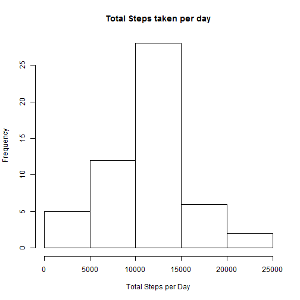
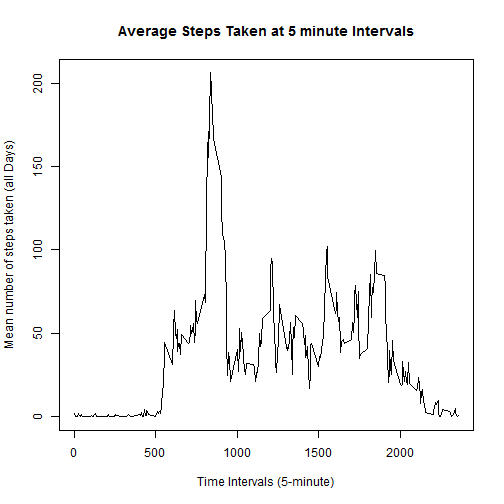
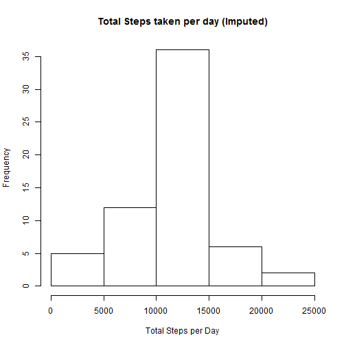
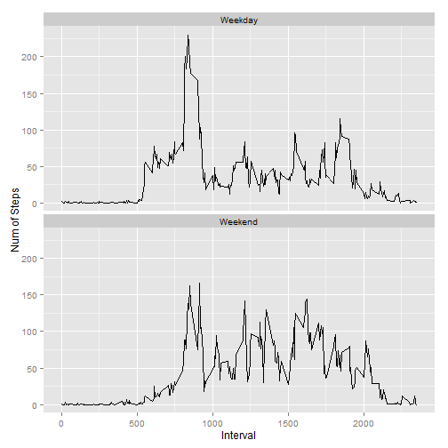

# Reproducible Research: PeerAssessment1

## Loading and preprocessing the data
Read the source file in the same folder.


```r
unzip("repdata-data-activity.zip")
activity <- read.csv("activity.csv")
activity$date <- as.Date(activity$date, "%Y-%m-%d")
```

## What is mean total number of steps taken per day?
Compute total steps per day.

```r
totSteps <- tapply(activity$steps, activity$date, sum)
```

Plot histogram of total steps per day.

```r
hist(totSteps, xlab= "Total Steps per Day", 
     ylab= "Frequency", main= "Total Steps taken per day")
```

 

Mean of total steps per day.

```r
mean(totSteps, na.rm= T)
```

```
## [1] 10766.19
```

Median of total steps pr day.

```r
median(totSteps, na.rm= T)
```

```
## [1] 10765
```

## What is the average daily activity pattern?
Compute the mean of steps over all days versus 5-minutes interval, null value is ignored.

```r
intvSteps <- tapply(activity$steps, activity$interval, mean, na.rm= T)
```

Time series plot of the mean of steps across all days vs 5-minute interval.

```r
plot(row.names(intvSteps), intvSteps, type= "l",
     xlab="Time Intervals (5-minute)", 
     ylab="Mean number of steps taken (all Days)", 
     main="Average Steps Taken at 5 minute Intervals")
```

 

Find out which 5-minute interval has maximum mean of steps across all days.

```r
intvIdx <- which.max(intvSteps)
intvMinute <- names(intvIdx)
```
The interval [835] minute contains the maximum mean of steps across all the days.  

## Imputing missing values
Total number of missing values

```r
sum(complete.cases(activity)== F)
```

```
## [1] 2304
```

For the 5-minute interval, fill missing value of Steps variable with the mean of steps across all days as following:

1. Find out the row of missing data in dataset.
2. Use the mean of steps over all days for 5-minutes interval to fill the missing data.
3. Create a new dataset that is equal to the original dataset but with the missing data filled.
4. Plot a histogram to report the mean and median 


```r
naIdx <- which(is.na(activity))

# get all the row of original data with steps is NA as character, 
# use it to retrive the relevant mean steps value computed earlier 
fillActivity <- intvSteps[as.character(activity[naIdx, 3])]
# name this vector with index of NA row
names(fillActivity) <- naIdx

# fill the imputed mean to the row of original data with steps==NA 
for (x in naIdx)
    activity$steps[x] <- fillActivity[as.character(x)]

intvStepsFilled <- tapply(activity$steps, activity$date, sum)

hist(intvStepsFilled, xlab= "Total Steps per Day", 
     ylab= "Frequency", main= "Total Steps taken per day (Imputed)")
```

 

compute the new mean of the steps across all intervals and days

```r
mean(intvStepsFilled)
```

```
## [1] 10766.19
```
compute the new median

```r
median(intvStepsFilled)
```

```
## [1] 10766.19
```

## Are there differences in activity patterns between weekdays and weekends?

```r
wDays <- weekdays(activity$date)

# create a new factor wdays
activity$wdays <- ifelse ( (wDays == "Saturday" | wDays == "Sunday"), 
                           "Weekend", "Weekday")
aggdata <- aggregate(activity$steps, 
                     by=list(activity$interval, activity$wdays), 
                     FUN=mean, na.rm=TRUE)
names(aggdata) <- c("interval", "wdays", "steps")

# use ggplot to draw the line chart
library(ggplot2)

g <- ggplot(aggdata)
g + geom_line(aes(x= interval, y= steps)) + 
    facet_wrap(~ wdays, ncol= 1) + 
    labs(x= "Interval") + 
    labs(y= "Num of Steps")
```

 


